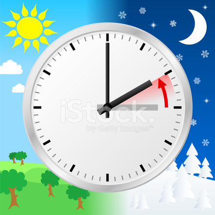

**Vintertid, normaltid Höst 2016**

_Nu är det dags att ställa om klockan igen. Den här gången vrider vi tillbaka den och får tillbaka den timme vi förlorade i våras. Kl.03:00 inatt mellan lördag och söndag ställer vi visaren på 02:00 istället._

 [ \[polldaddy poll=9564599\]](https://worldwideweatherblog.wordpress.com/wp-content/uploads/2016/10/34907072-daylight-saving-time-ends.jpg)
