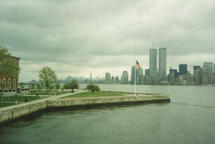

**Årsdagen av 9/11**

_Idag är det 16 år sedan terrorattentatet mot tvillingtornen i New York._

 _Då. Manhattans skyline domineras av Tvillingtornen._

 _Nu. Minnesmonumentet med vattenfall och ett nytt torn som byggts vid sidan om._
