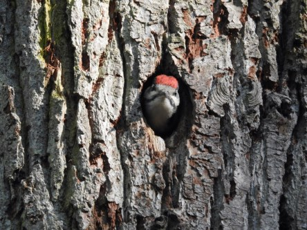
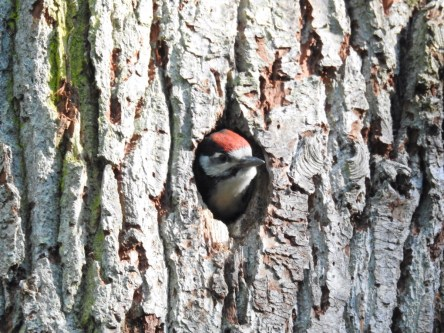
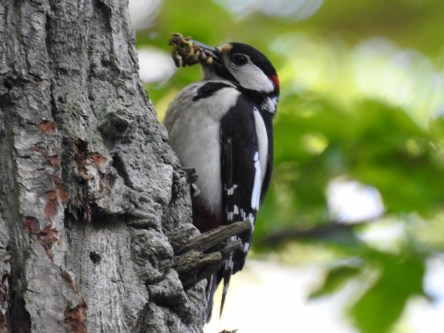
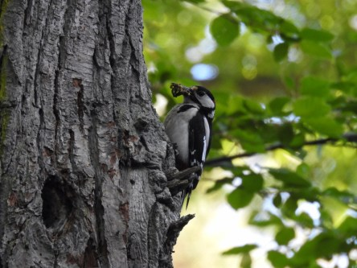
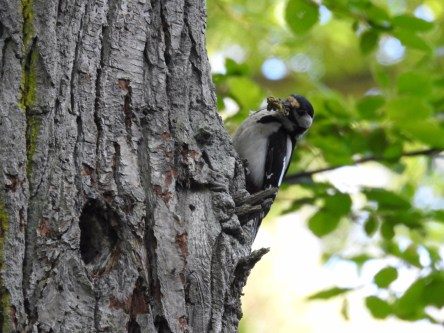
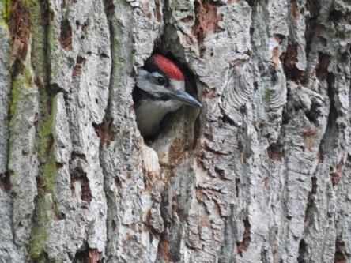
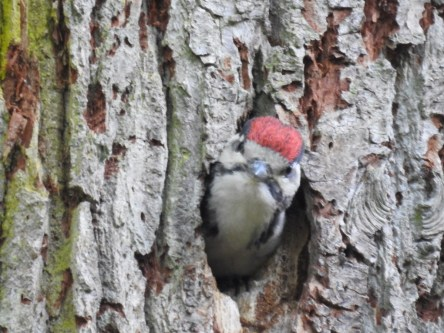
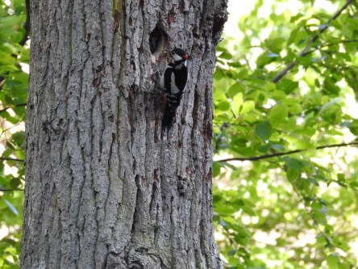
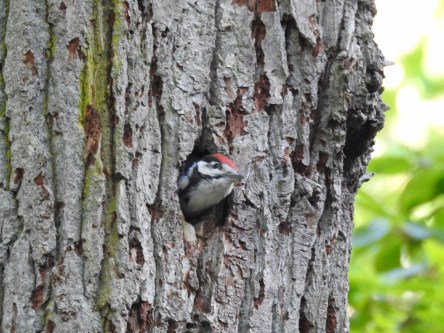

**Den som väntar på något gott...**

_Lille baby Hacke är hungrig och pappa Hacke har hittat massor av godsaker._

 _Hallå där, kommer du med något käk snart?_

 _Ja, jag kommer! Men lugna ner dig lite. Jag måste bara kolla så att den där hopplösa människan där nere med den kanonliknande prylen inte utgör någon fara._

 _Va? Vem då? Jag ser ingen._

 _Okej, jag får väl hoppas på det bästa då. Här kommer maten. Smaklig måltid._

 _Åh! Tack, det var riktigt smaskigt._

 _Du, pappa. Nu ser jag också den där mysko typen med kanonen._

Spara
