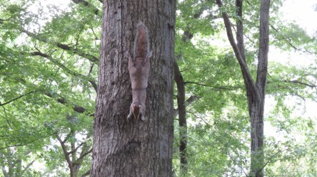
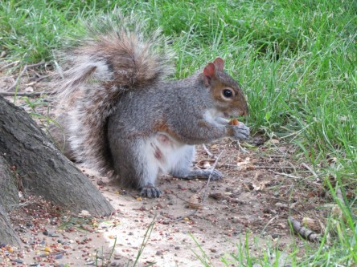
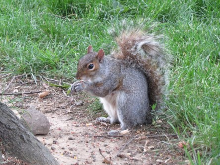

**Ekorrar i Central Park i New York**

_Dessa bedårande söta små ekorrar i Central Park i New York är mästare på att tigga mat. Vem kan motstå dem?_

 

 _De är helt oemotståndliga och det vet de._
