**En liten rundvandring på Södermalm i Stockholm**

[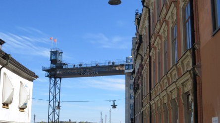](https://worldwideweatherblog.wordpress.com/wp-content/uploads/2017/05/img_4638-desktop-resolution.jpg) _En av alla utsiktsplatser i Stockholm._

[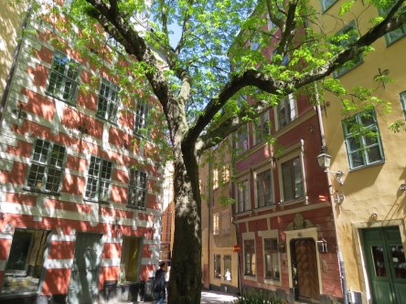](https://worldwideweatherblog.wordpress.com/wp-content/uploads/2017/05/img_4740-desktop-resolution.jpg) _Massor av små mysiga gränder och restauranger._

[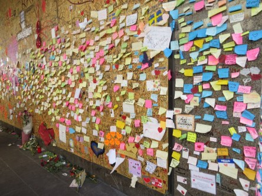](https://worldwideweatherblog.wordpress.com/wp-content/uploads/2017/05/img_4785-desktop-resolution.jpg) _Men även platser som påminner oss om vilken sjuk värld vi lever i trots allt fint som finns. Här körde lastbilen in i folkmassan och dödade [fem](http://www.aftonbladet.se/nyheter/a/XXWrE/de-dog-i-terrorattacken-i-stockholm) personer._

[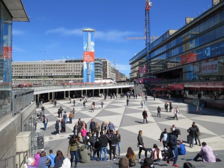](https://worldwideweatherblog.wordpress.com/wp-content/uploads/2017/05/img_4788-desktop-resolution.jpg) _Sergels torg._

[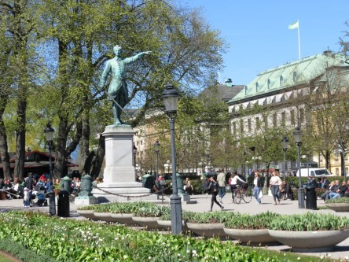](https://worldwideweatherblog.wordpress.com/wp-content/uploads/2017/05/img_4826-desktop-resolution.jpg) _Härliga parker överallt._

 _Slottet i Stockholm._

[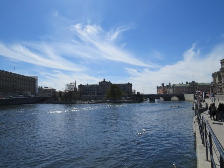](https://worldwideweatherblog.wordpress.com/wp-content/uploads/2017/05/img_4835-desktop-resolution.jpg)

 _Riksdagshuset i Stockholm._

[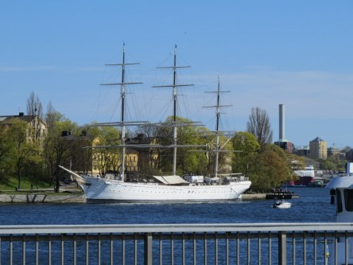](https://worldwideweatherblog.wordpress.com/wp-content/uploads/2017/05/img_4847-desktop-resolution.jpg) _En flytande restaurang._

 _Det är gott om museum överallt. Här National Museum._

[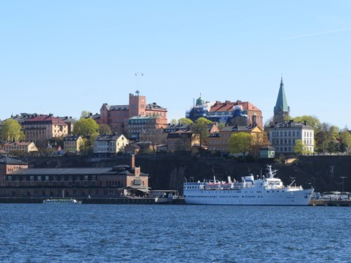](https://worldwideweatherblog.wordpress.com/wp-content/uploads/2017/05/img_4874-desktop-resolution.jpg) _Vy över stan._

 _Stockholmstidningar._

[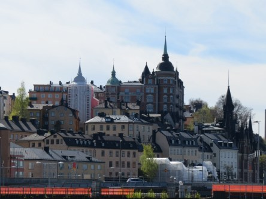](https://worldwideweatherblog.wordpress.com/wp-content/uploads/2017/05/img_4918-desktop-resolution.jpg)

[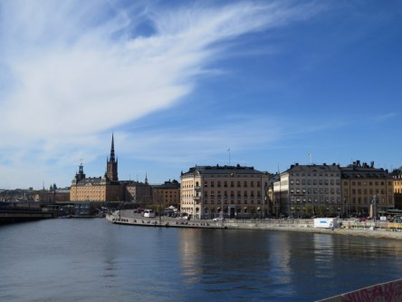](https://worldwideweatherblog.wordpress.com/wp-content/uploads/2017/05/img_4920-desktop-resolution.jpg)

 _Vyer över Stockholm._

 _Kaknästornet._

 O_ch naturligtvis Grönalund._

 _Ännu mer mysiga gränder och gator._

[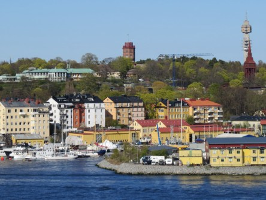](https://worldwideweatherblog.wordpress.com/wp-content/uploads/2017/05/img_4975-desktop-resolution.jpg) _Fler vyer över stan._

[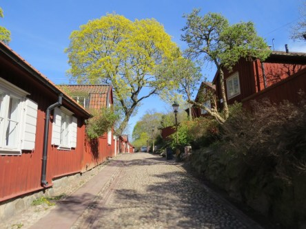](https://worldwideweatherblog.wordpress.com/wp-content/uploads/2017/05/img_4987-desktop-resolution.jpg)

[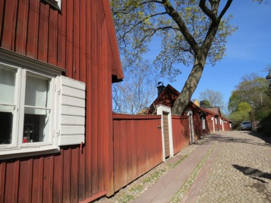](https://worldwideweatherblog.wordpress.com/wp-content/uploads/2017/05/img_4991-desktop-resolution.jpg)

[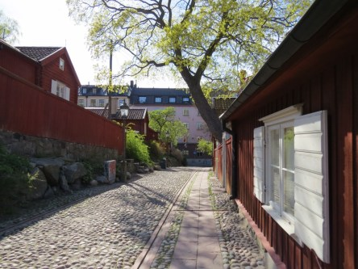](https://worldwideweatherblog.wordpress.com/wp-content/uploads/2017/05/img_4993-desktop-resolution.jpg) _Söderkåkar. Här spelades den väldigt populära tv serien med samma namn in._

[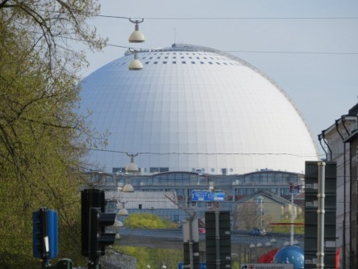](https://worldwideweatherblog.wordpress.com/wp-content/uploads/2017/05/img_5004-desktop-resolution.jpg) _Och naturligtvis måste Globen vara med._

 _Liksom Göta Lejon._

 _Och sist men inte minst: Södra Teatern där..._

 _... huvudpersonen för vår resa uppträdde: [Midge Ure](https://www.youtube.com/watch?v=RQRGoIxqhbk), sångaren i kultbandet Ultravox._

 _Så var det dags för hemfärd efter en härlig helg._

Spara
