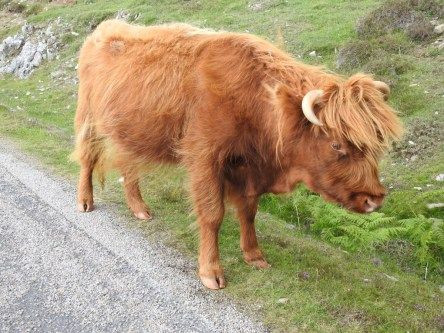
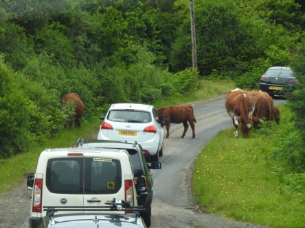
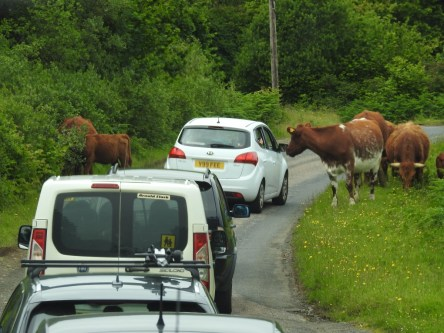
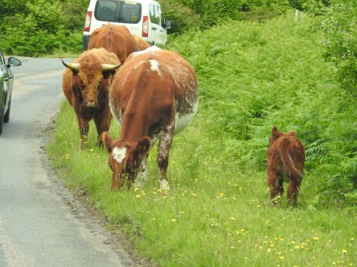

**Highland Cattle**

_Vart man än vänder sig i Skottland så finns det kossor av rasen Highland Cattle. De finns i brunt,svart, ljusbeige och nästan guldbrunt. Många av dem strövar omkring fritt på både vägar och ängar. Bilarna får ofta stå och vänta på att de sakta ska gå över vägen och släppa fram trafiken igen. De är så roliga att se på när de helt obekymrade går omkring helt fritt tillsammans med helt vanliga kor också._

