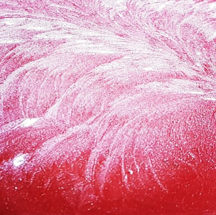
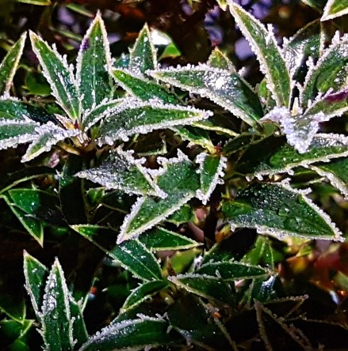
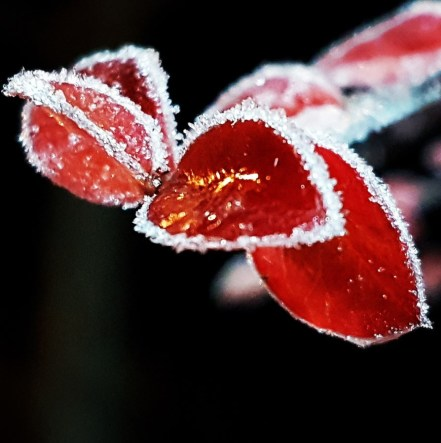

**Naturliga konstverk**

_Inatt var naturen riktigt kreativ och rita många vackra mönster på brevlådor och växter._

 _Vackert dekorerade brevlådslock._

 _Även växterna fick en vacker utsmyckning._
