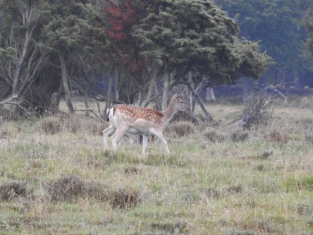
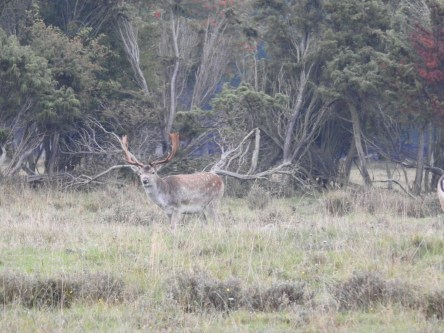
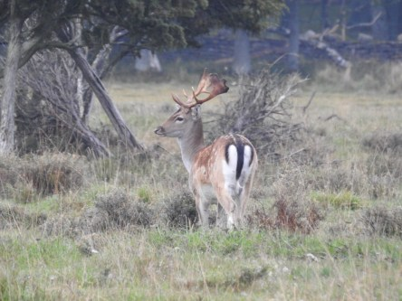
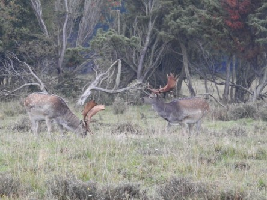
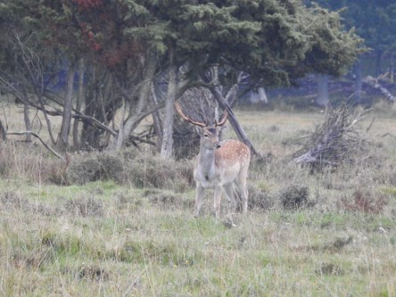
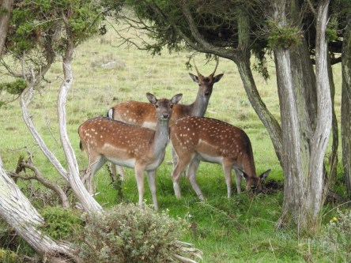

**Hjortar på södra Öland**

_I Ottenby på södra Öland kan man se mer än bara fåglar. Där strövar även hjortar omkring bland kossor och fåglar._

 _Första dagen var vädret väldigt grått, så det var svårt att få bra bilder._

 _Andra dagen var det lite bättre ljusförhållanden så bilderna blev bättre._
