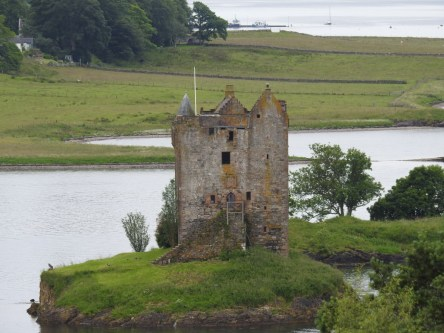
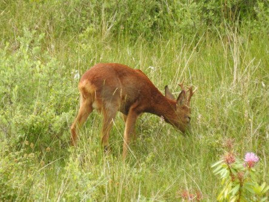
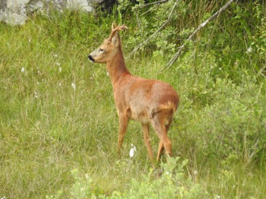

**Rådjur i Plockton**

_Det är gott om rådjur i Skottland, men det an vara knepigt att få syn på dem. Som här hemma så är det mest i gryning och skymning som de är synliga. Den här hade vi turen att få se utanför vårt sovrumsfönster där vi bodde i Plockton på höglandet._

