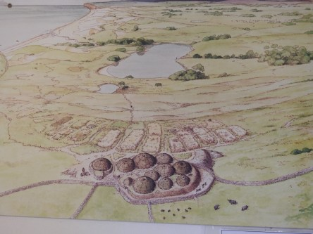
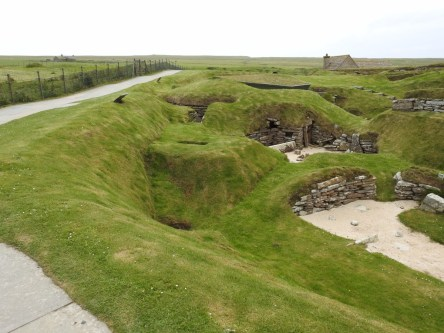
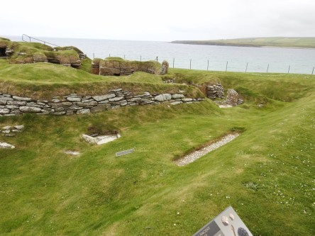
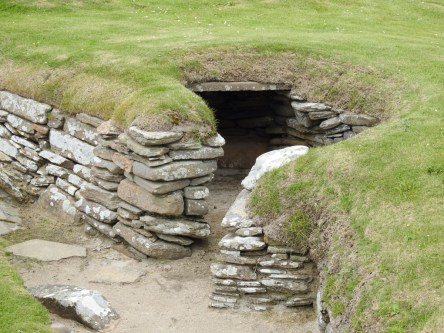
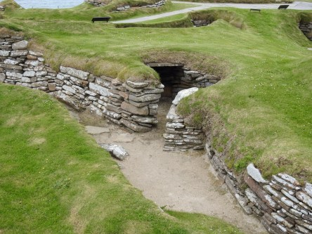
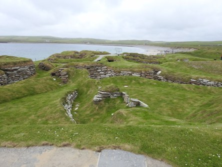
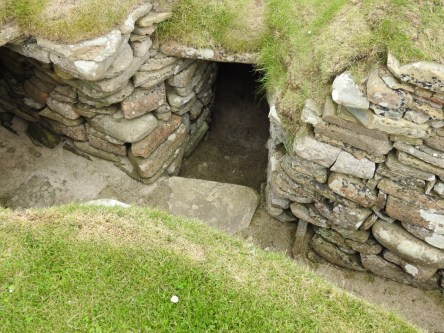
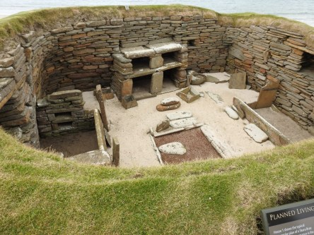
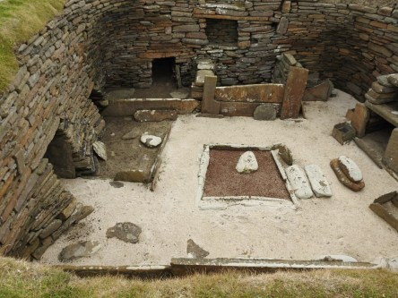

**Skottlands eget Pompeij**

_Skara Brae på Orkneyöarna är en grupp små hus som en gång utgjorde en egen liten by i Bay of Skaill. Idag återstår bara ruinerna som små gropar i marken med gångar emellan. Du kan läsa mer om Skara Brae [här](https://sv.wikipedia.org/wiki/Skara_Brae)._

 _Så här såg det förmodligen ut när folk bodde där._

 _med tanke på hur små husen verkar ha varit så var det nog väldigt kortväxta människor som bodde där._

 _Byn ligger väldigt nära havet._
