**Isle of Skye del 4**

_I dagens inlägg fortsätter vår resa på Isle of Skye till The old man of Storr och vi tittar även på fotavtryck från dinosaurier._

[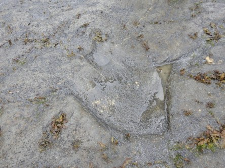](https://worldwideweatherblog.wordpress.com/wp-content/uploads/2017/12/dscn8036-desktop-resolution.jpg)

[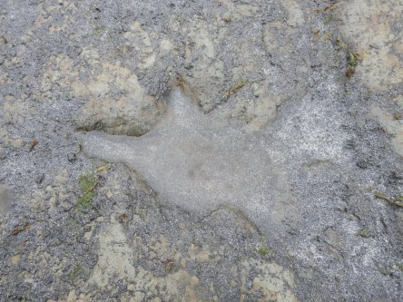](https://worldwideweatherblog.wordpress.com/wp-content/uploads/2017/12/dscn8046-desktop-resolution.jpg) _Detta är fotavtryck av riktiga dinosaurier som vandrade här på jorden en gång i tiden._

 _Informationsskylt som berättar om platsen._

[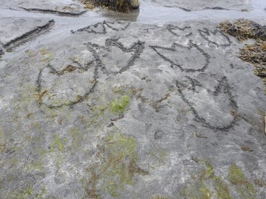](https://worldwideweatherblog.wordpress.com/wp-content/uploads/2017/12/dscn8047-desktop-resolution.jpg)

[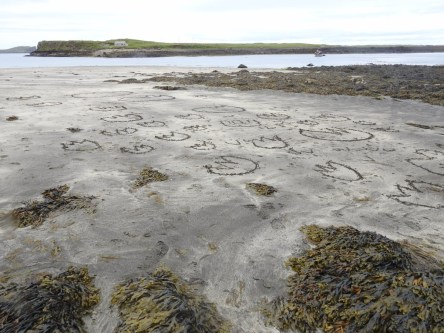](https://worldwideweatherblog.wordpress.com/wp-content/uploads/2017/12/dscn8048-desktop-resolution.jpg) _Många roar sig med att rita söta fotavtryck i sanden._

[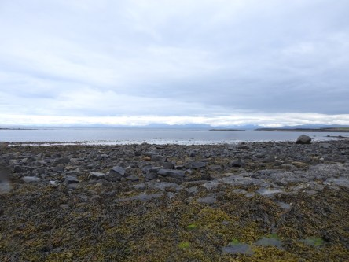](https://worldwideweatherblog.wordpress.com/wp-content/uploads/2017/12/dscn8041-desktop-resolution.jpg)

[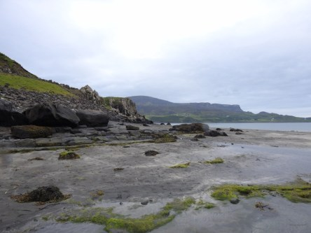](https://worldwideweatherblog.wordpress.com/wp-content/uploads/2017/12/dscn8043-desktop-resolution.jpg)

 _Det är väldigt vackert vid den här stranden. Och vi hade tur att det var ebb när vi var där, för det är bara då man kan se fotav- trycken_

 _Nu går färden vidare mot The Kilt._

[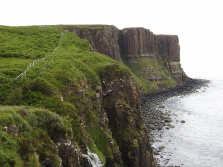](https://worldwideweatherblog.wordpress.com/wp-content/uploads/2017/12/dscn8060-desktop-resolution.jpg)

[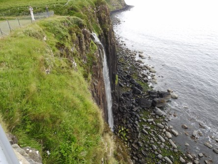](https://worldwideweatherblog.wordpress.com/wp-content/uploads/2017/12/dscn8062-desktop-resolution.jpg)

[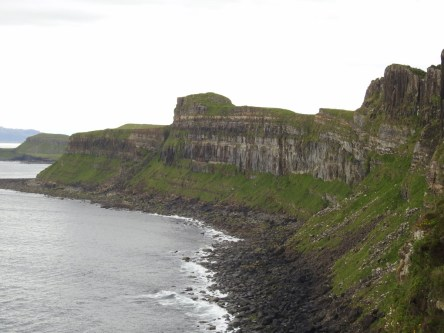](https://worldwideweatherblog.wordpress.com/wp-content/uploads/2017/12/dscn8066-desktop-resolution.jpg)

[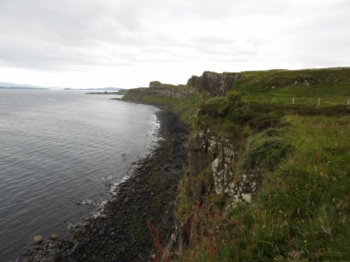](https://worldwideweatherblog.wordpress.com/wp-content/uploads/2017/12/dscn8069-desktop-resolution.jpg)

 _The Kilt är en klippformation som från luften ser ut som en skotsk kilt. Här finns ett fantastiskt vattenfall och vyerna mot havet är otroligt vackert att se_

[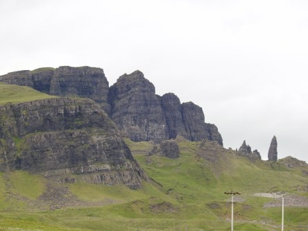](https://worldwideweatherblog.wordpress.com/wp-content/uploads/2017/12/dscn8096-desktop-resolution.jpg)

[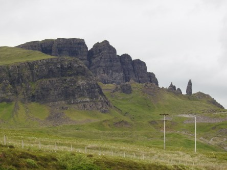](https://worldwideweatherblog.wordpress.com/wp-content/uploads/2017/12/dscn8100-desktop-resolution.jpg)

[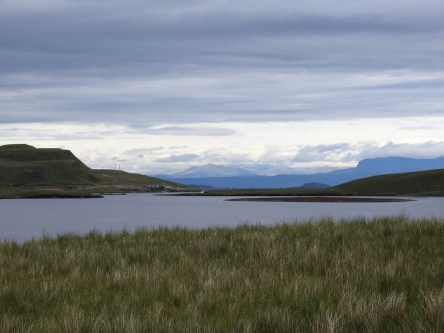](https://worldwideweatherblog.wordpress.com/wp-content/uploads/2017/12/dscn8105-desktop-resolution.jpg)

[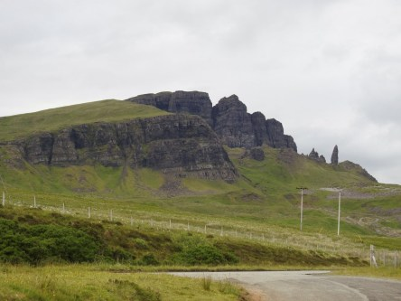](https://worldwideweatherblog.wordpress.com/wp-content/uploads/2017/12/dscn8106-desktop-resolution.jpg) _Nu är vi framme vid The old men of Storr som är ett välbesökt turistmål med sina speciella klippor och vackra omgivning._

_I nästa inlägg fortsätter vi till huvudstaden på Isle of Skye för att sedan avsluta vår vistelse på ön och köra tillbaks till fastlandet._
