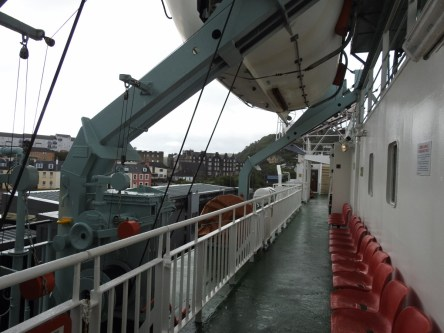
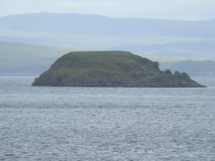
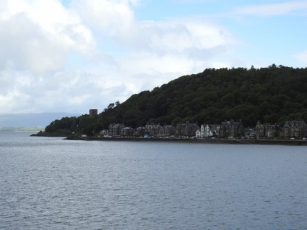
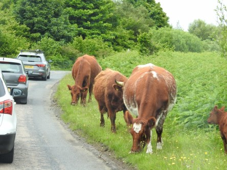
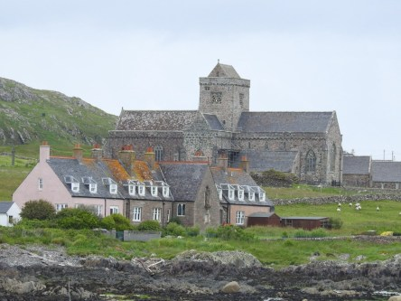
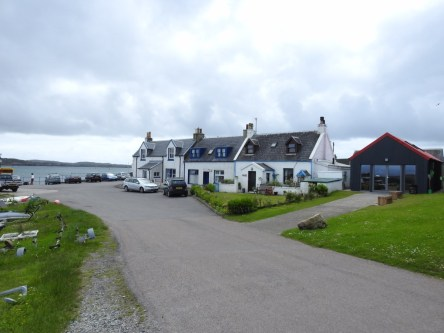
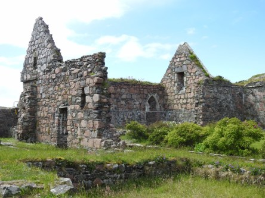
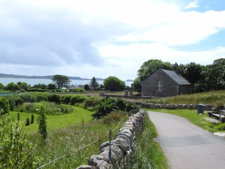

**Från Oban till Iona**

_Idag går resan vidare över till Iona. Det är en väldigt vacker ö och helt fantastiskt att bara gå omkring och njuta av vacker natur och vackra byggnader. Från Iona åker man sedan vidare till fågelön Staffa som jag skrivit om i ett tidigare inlägg och som jag kommer att visa lite mer av i del 3 i den här serien inlägg från Skottland._

 _Färjan över till Iona._

 _En sista blick mot Oban innan vi åker._

 _En av alla små öar i havet._

 _På väg med färjan._

 _Ännu ser vi Oban._

 _Vädret klarnar upp och blå himmel syns._

 _Man kan bara njuta av utsikten._

 _Nu är vi framme på ön och ska tillbringa några timmar här innan vi åker över till Staffa._

 _En helt vanlig trafikdag i Skottland._

 _En skylt välkomnar oss till Iona._

 _Små härliga gator att vandra omkring på._

 _Som överallt i Skottland så hör ruiner till bilden._

 _Efter en liten rundvandring är det dags att ta båten över till Staffa. Men det finns så mycket mer att se på denna vackra ö, så det får bli fler besök här någon gång framöver._

_I nästa inlägg går färden till Staffa._
