**Från Iona till Staffa**

_I dagens inlägg tar vi båten över till fågelön Staffa. Där väntar lunnefåglarna på oss och även den fantastiska Fingals Cave grottan. En del av dessa bilder finns med i tidigare inlägg, men de tål att ses igen eftersom den här ön är något utöver det vanliga._

 _Nu ger vi oss iväg med båten och en väldigt skumpig båtfärd väntar._

[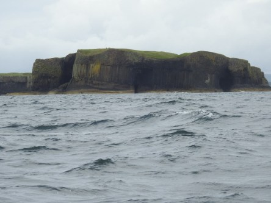](https://worldwideweatherblog.wordpress.com/wp-content/uploads/2017/09/dscn6863-desktop-resolution.jpg) _Efter en timmes färd med höga vågor ser en första skymt av Staffa._

 _Nu är vi framme och får se grottan Fingals Cave som vi senare ska gå in i._

 _Båten tar oss runt till den sida av ön som vi ska kliva iland på._

 _Här har vi tagit oss upp till toppen på ön._

 _Utsikten är fantastisk._

 _Vandringen bort till lunnefåglarna bjuder på underbar natur._

 _Det är inte helt lätt att få bilder på dessa fåglar eftersom de gärna gömmer sig i gräset och i sina små bohålor som de har utmed det branta stupet. på ön._

 _Utsikt in mot ön._

[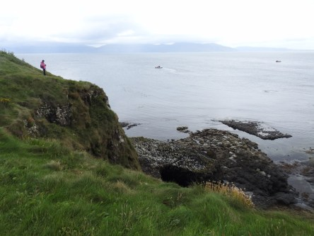](https://worldwideweatherblog.wordpress.com/wp-content/uploads/2017/09/dscn6917-desktop-resolution.jpg) _Utsikt mot havet._

[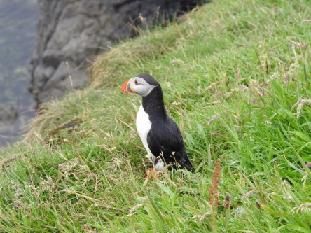](https://worldwideweatherblog.wordpress.com/wp-content/uploads/2017/09/dscn6922-desktop-resolution.jpg) _Här spanar en lunnefågel ner mot sina kompisar i havet._

 _Det är fullt av dem där nere._

[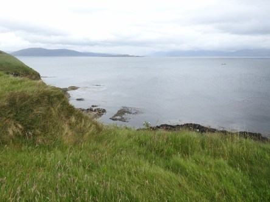](https://worldwideweatherblog.wordpress.com/wp-content/uploads/2017/09/dscn6925-desktop-resolution.jpg)

[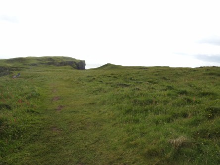](https://worldwideweatherblog.wordpress.com/wp-content/uploads/2017/09/dscn6927-desktop-resolution.jpg) _Nu börjar vandringen tillbaks för ett besök i Fingals Cave._

[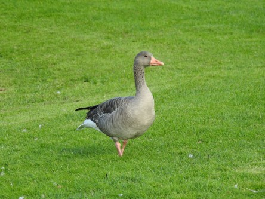](https://worldwideweatherblog.wordpress.com/wp-content/uploads/2017/09/dscn6930-desktop-resolution.jpg) _Då börjar den bitvis ganska knepiga vandringen till grottan._

[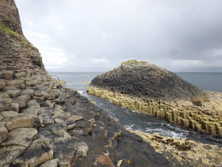](https://worldwideweatherblog.wordpress.com/wp-content/uploads/2017/09/dscn6935-desktop-resolution.jpg) _Även här får vi se en helt fantastisk klippformation._

[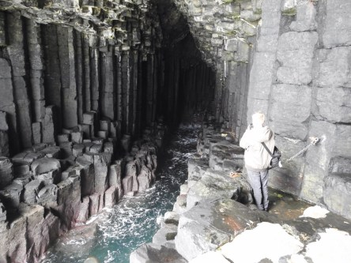](https://worldwideweatherblog.wordpress.com/wp-content/uploads/2017/09/dscn6938-desktop-resolution.jpg) _Här är vi inne i grottan som är helt upplyst av solen. En bit längre in är det helt mörkt. Akustiken här inne är otrolig._

[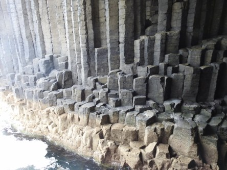](https://worldwideweatherblog.wordpress.com/wp-content/uploads/2017/09/dscn6939-desktop-resolution.jpg) _Klippformationer i grottan._

 _Utsikt inifrån grottan._

 _Nu är vi på väg tillbaks till båten för hemfärd._

[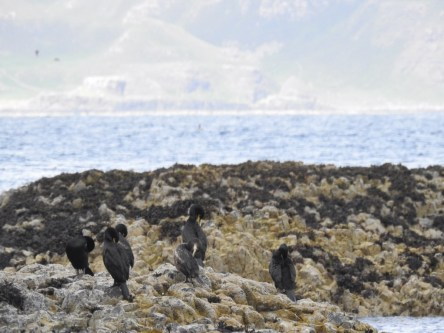](https://worldwideweatherblog.wordpress.com/wp-content/uploads/2017/09/dscn6946-desktop-resolution.jpg) _Ett gäng storskarvar solar sig och putsar fjädrarna._

[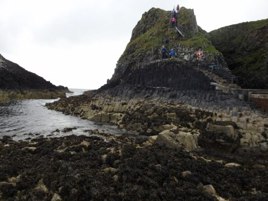](https://worldwideweatherblog.wordpress.com/wp-content/uploads/2017/09/dscn6950-desktop-resolution.jpg) _En blick tillbaks på denna fantastiska ö, där nu nya besökare är på väg upp._

 _Nu lämnar vi Staffa för en timmes båtfärd med lika mycket vågor igen._

[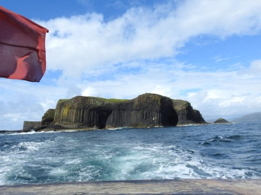](https://worldwideweatherblog.wordpress.com/wp-content/uploads/2017/09/dscn6963-desktop-resolution.jpg) _En sista tillbakablick innan ön försvinner ur siktet._

 _Nu är vi framme och ska kliva iland igen efter en fantastisk upplevelse._

_I nästa inlägg åker vi vidare på Isle of Mull med dess vackra natur._
