**Fort William och Plockton**

_Idag går färden vidare till Fort William och Plockton. På vägen dit är det mycket att se. Landskapet är helt fantastiskt och det finns hur mycket som helst att visa. Det är svårt att välja bilder så det blir ganska många i det här inlägget._

 _På vägen till Fort William stannade vi till och tittade på detta monument över klanen Macdonalds chef Mc.Ian som dog i massakern vid Glencoe 1692._

 _En höna som trivs i solen._

 _Härlig lummig terräng en bit nedanför monumentet._

[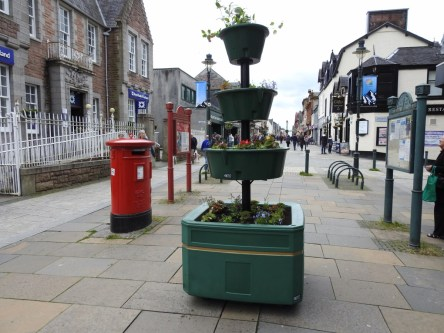](https://worldwideweatherblog.wordpress.com/wp-content/uploads/2017/10/dscn7324-desktop-resolution.jpg)

[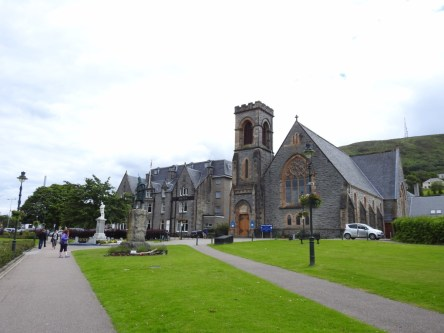](https://worldwideweatherblog.wordpress.com/wp-content/uploads/2017/10/dscn7335-desktop-resolution.jpg)

[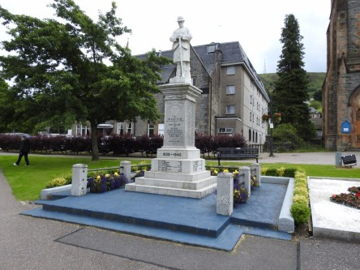](https://worldwideweatherblog.wordpress.com/wp-content/uploads/2017/10/dscn7336-desktop-resolution.jpg) _Här tar vi en promenad genom Fort William i jakten på något att äta. En trevlig liten stad som består av i stort sett en huvudgata._

 _Färden går vidare på slingriga vägar med berg runtomkring._

 _På långt håll ser vi Ben Nevis, Skottlands högsta berg._

[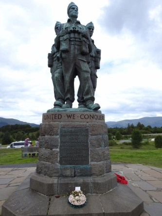](https://worldwideweatherblog.wordpress.com/wp-content/uploads/2017/10/dscn7365-desktop-resolution.jpg)

 _Här finns även ett monument över stupade soldater i andra världskriget._

 _Sen fortsätter färden längs vackra sjöar och berg._

[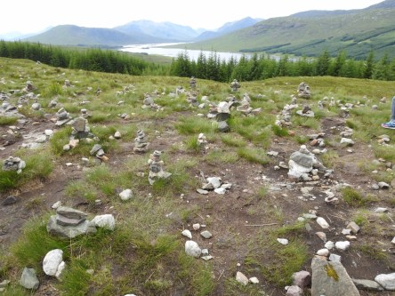](https://worldwideweatherblog.wordpress.com/wp-content/uploads/2017/10/dscn7415-desktop-resolution.jpg)

 _Här stannar vi till för att se små stenhögar som folk har byggt som en gåva till någon de älskar eller av vilken anledning som helst i stort sett. En börjar och andra följer efter._

[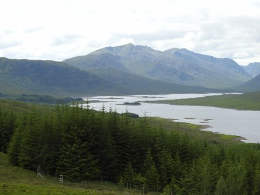](https://worldwideweatherblog.wordpress.com/wp-content/uploads/2017/10/dscn7425-desktop-resolution.jpg) _Vidunderlig utsikt över sjön och bergen i bakgrunden._

 _Sen åker vi vidare mot Plockton förbi ännu fler vackra berg._

 _Väl framme i Plockton installerar vi oss i vårt lilla mysiga B&B._

 _Utanför vårt fönster går ett rådjur och betar fridfullt._

 _Utsikt från vårt sovrum._

[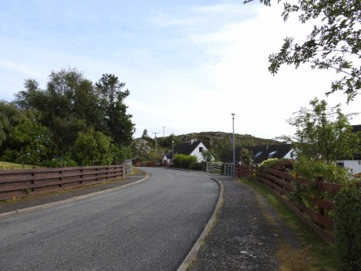](https://worldwideweatherblog.wordpress.com/wp-content/uploads/2017/10/dscn7554-desktop-resolution.jpg) _Dags för en kvällspromenad runt den lilla charmiga byn som består av en gata, så det är omöjligt att gå vilse._

[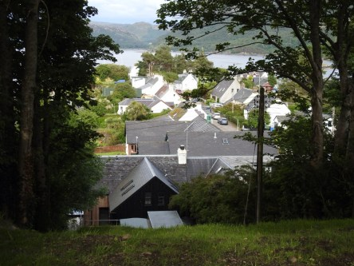](https://worldwideweatherblog.wordpress.com/wp-content/uploads/2017/10/dscn7559-desktop-resolution.jpg)

[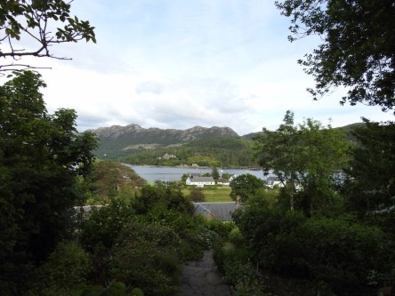](https://worldwideweatherblog.wordpress.com/wp-content/uploads/2017/10/dscn7562-desktop-resolution.jpg)

[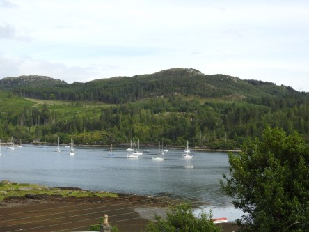](https://worldwideweatherblog.wordpress.com/wp-content/uploads/2017/10/dscn7566-desktop-resolution.jpg)

[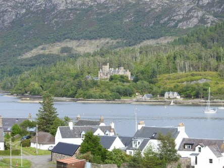](https://worldwideweatherblog.wordpress.com/wp-content/uploads/2017/10/dscn7574-desktop-resolution.jpg)

[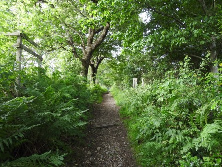](https://worldwideweatherblog.wordpress.com/wp-content/uploads/2017/10/dscn7583-desktop-resolution.jpg) _Ett litet ställe men så avkopplande och skönt att gå runt. Allt från lummig skog till en vacker sjö och ett ståtligt slott._

 _The mainstreet of Plockton. Detta är den enda gatan i byn. Utmed  den ligger det flera hotell och B&B samt några restauranger med begränsade platser._

[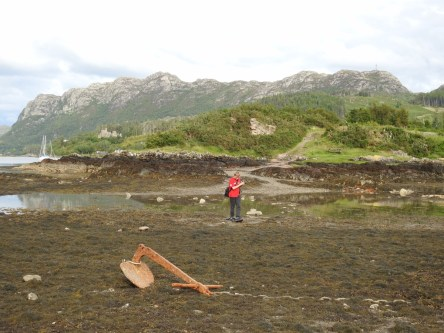](https://worldwideweatherblog.wordpress.com/wp-content/uploads/2017/10/dscn7587-desktop-resolution.jpg) _Här kan man gå på sjöbottnen när det är ebb. Men det går väldigt snabbt när floden kommer. Så det gäller att skynda sig tillbaks så man slipper simma iland, hahaha._

_I nästa inlägg går färden över till Isle of Skye._
