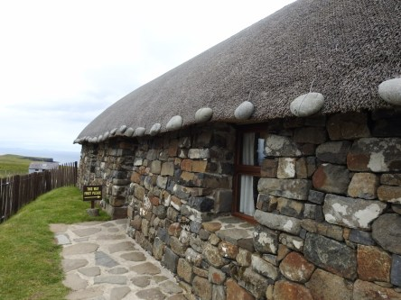
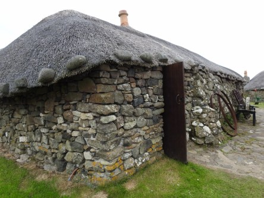
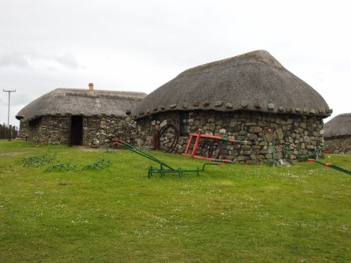
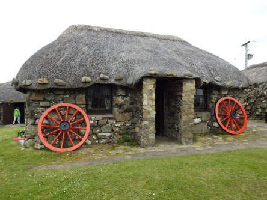
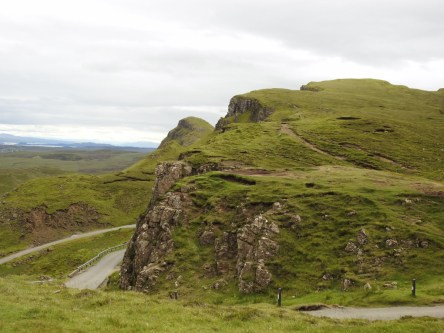
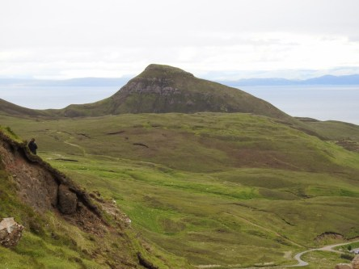
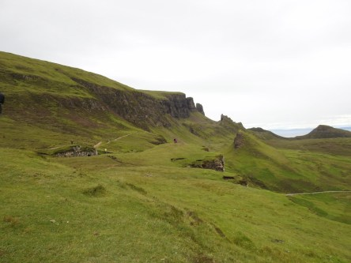
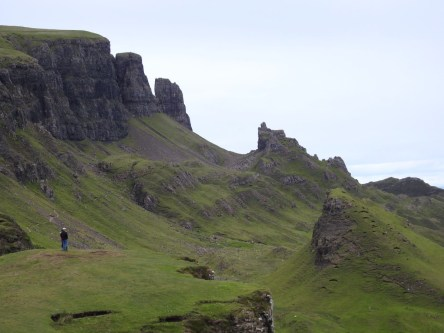
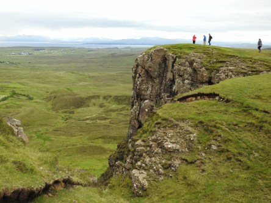
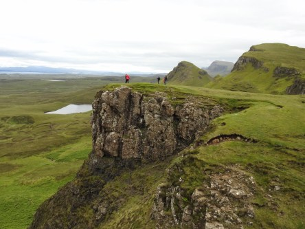

**Isle of Skye del 3**

_I dagens inlägg börjar jag med några bilder i repris från Skye Museum of Island life. Fler bilder från detta utomhusmuseum finns i ett tidigare inlägg. Efter detta museum går färden vidare till det otroligt vackra Quiraing. Det är något av det mest fantastiska jag sett. Naturen är så otroligt vacker och man blir helt avslappnad och bara njuter av allt det storslagna omkring sig. Det är svårt att göra ett sånt här ställe rättvisa med kameran men jag har försökt att fånga det så gott det gick._

 _Några bilder från Skye Museum of Island life. Fler bilder finns i ett tidigare inlägg._

 _Nu går färden vidare till Quiraing._

 _Vägen upp är brant, smal och väldigt slingrig._

 _Väl uppe är det andlösa vidder och utsikten är otrolig._

 _Vi tittar ner på den slingriga vägen som vi nyss åkte upp på._

 _Vidderna och utsikten är oändlig känns det som._

_I nästa inlägg går färden vidare till Old man of Storr och vi besöker även havsbottnen där dinosaurierna en gång vandrade omkring och där fotavtrycken fortfarande finns kvar._
