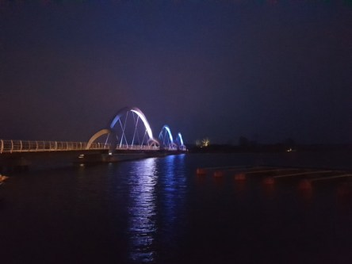

**Den prisbelönta Sölvesborgsbron**

_Vid ett kvällsbesök i Sölvesborg tog jag några bilder på den prisbelönta [Sölvesborgsbron](https://sv.wikipedia.org/wiki/S%C3%B6lvesborgsbron) när den var belyst._

 _Det var tyvärr väldigt dimmigt så bilderna blev ganska gryniga._
