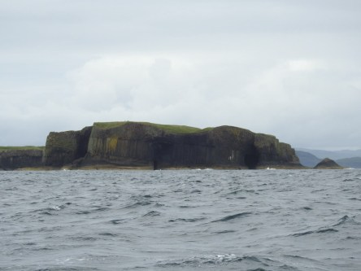
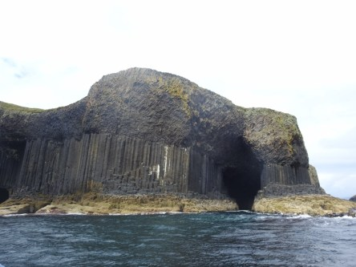
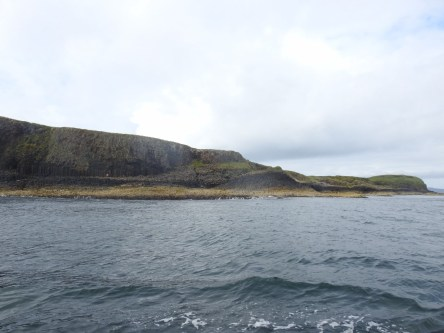
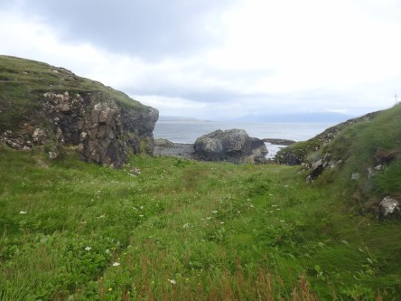
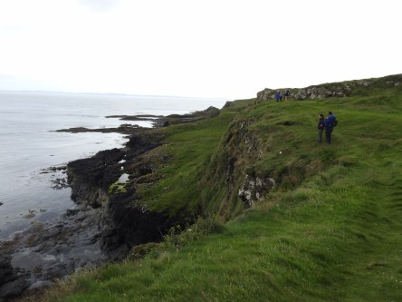
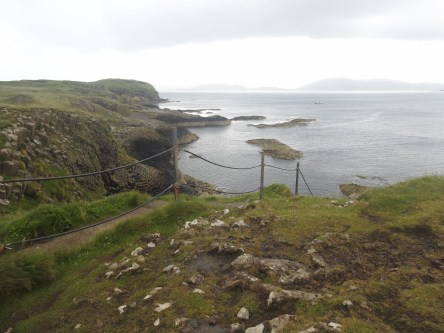
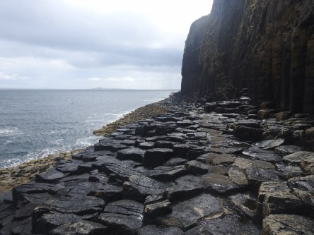
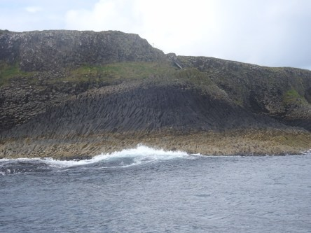
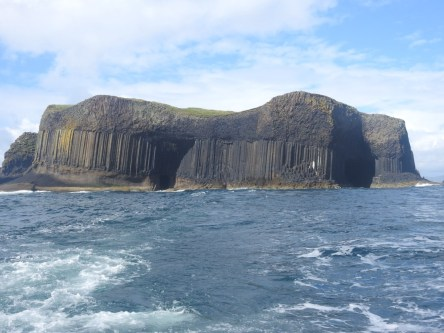

**Fågelön Staffa**

_Staffa är en liten obebodd ö som tillhör inre Hebriderna i Skottland. Det är en timmes väldigt gungig båtfärd dit och sen väntar en brant trappa upp till själva ön. Efter att man vandrat runt på ön för att får se Lunnefåglarna som bor där så väntar den fantastiska grottan [Fingals Cave](https://sv.wikipedia.org/wiki/Fingals_grotta) på ett besök._

 _På väg ut till Staffa med båten._

 _Väl uppe på ön så har vi en fantastisk utsikt._

 _Och det är Lunnefåglar överallt. De har dock en tendens att hinna krypa in i sina små hål innan man hunnit få bilder på dem. Men de kom inte undan helt i alla fall._

 _Nu börjar vandringen till Fingals Cave. Inte en helt lätt promenad._

 _Väl inne i grottan så får vi vår belöning. Det är helt fantastiskt därinne. Som en helt annan värld, en annan planet._

 _Sen bär av tillbaks till Isle of Iona igen för att därefter ta båten över till fastlandet. Ett obeskrivligt äventyr är över._
