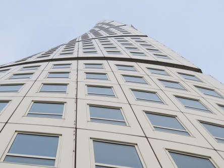

**Turning Torso Malmö**

_Vid ett besök i Malmö idag passade vi på att ta lite bilder på Turning Torso som är Sveriges och Nordens högsta skyskrapa. Den började byggas 14 Februari 2001 och invigdes 27 Augusti 2005. Den är 190 meter hög och har 54 våningar. Eftersom det är i huvudsak ett bostadshus så har allmänheten endast möjlighet att besöka den och se utsikten under några sommarveckor per år och då i små grupper och endast vid förhandsbokning. Ett besök kostar 195 kronor._

