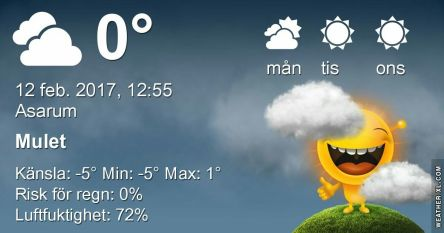

 _Grått och mulet idag, men nästa vecka blir det äntligen varmare igen med flera plusgrader dagtid mot mitten av veckan och även nattetid mot slutet av veckan. En hel del sol till att börja med och sedan ökande molnighet igen._
