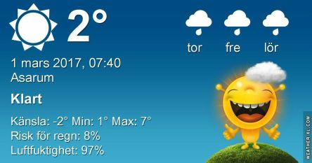

 _Efter en mestadels klar morgon mulnar det snabbt på igen. Temperaturen hamnar omkring 5 grader och det blir fortsatt molnigt de närmaste dagarna. Till helgen vänta snö och det blir även kallare med omkring 1 till 3 plusgrader dagtid och flera minusgrader på nätterna._
