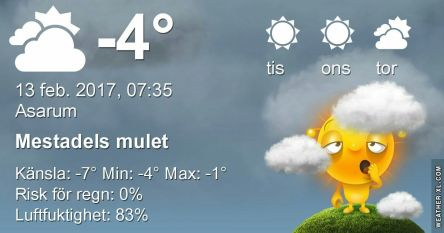

 _Just nu mest mulet, men chans till en del sol under dagen. Plusgrader på dagarna, men några kalla nätter till. Mot slutet av veckan väntas plus-grader även på nätterna. Molnigt till helgen och någon regnskur._

Spara
