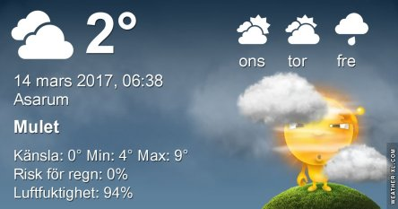

 _Dimma på morgonen och minusgrader. Det ser ut att bli mest molnigt under dagen och omkring 8 grader. På onsdagen blir det en del sol och omkring 8 grader och torsdagen molnigt med upp till 10 grader. Slutet på veckan soligt och omkring 6 grader. Mer väder ser du [här](http://www.vackertvader.se/asarum/10d/yr-smhi)._
