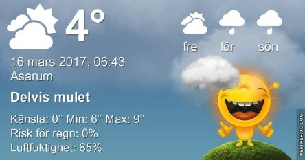

 _Efter en molnig morgon klarnar det upp och solen tittar fram_ _och det blir omkring 11 grader. På fredag blir det mera moln och någon regnskvätt och omkring 8 grader. Helgen blir delvis solig och delvis molnig med temperaturer mellan 5 och 7 grader. Natten till söndag kan det bli någon minusgrad, i övrigt blir nätterna på plussidan och dagarna mer vårlika nu. Mer väder ser du [här](http://www.vackertvader.se/asarum/10d/yr-smhi)._
