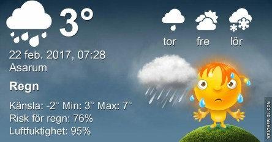

 _Regn och blåsigt på morgonen. Under förmiddagen väntas det dra vidare och det finns chans till lite mer sol. Fortsatt blåsigt och lite kallare under helgen. På söndag mulnar det till igen och kan komma snö som går över i regn. Temperaturen ligger någonstans mellan 3 och 7 grader närmaste veckan._
