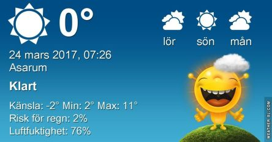

 _Dagen börjar med flera minusgrader och sol. Det soliga vädret fortsätter med upp till 11 grader under dagen. Lördag blir något mer molnig och upp till 12 grader. Söndagen blir solig och varm med upp till 14 grader. Även nätterna ser ut att bli varmare igen. En längre prognos ser du [här](http://www.vackertvader.se/asarum/10d/yr-smhi)._
