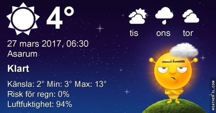

 _Morgonen är kylig och mest klart. Det blir en hel del sol och varmt med upp till 16 grader under dagen. Tisdag blir något kallare med växlande molnighet och omkring 12 grader. På onsdag kommer kallare luft in och det blir mest molnigt med omkring 8 grader. En längre prognos ser du [här](http://www.vackertvader.se/asarum/10d/yr-smhi)._
