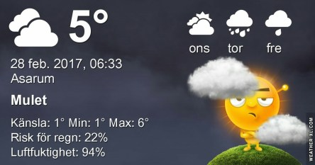

 _Molnigt och duggregn på morgonen. Det kan klarna upp till eftermiddagen och natten. Kan eventuellt bli fortsatt mulet och en del regn. Temperatur kring 5- 6 plusgrader. På onsdag blir det en del sol och resten av veckan ser ut att bli molnig. Dagstemperaturer kring 3-7 plusgrader och nätterna kring nollan och någon enstaka plusgrad._
