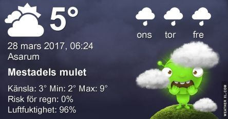

 _Dagen börjar med mulet och kallt väder. Det finns chans till sol längre fram med temperaturer upp till 12 grader. Onsdag blir molnig och kallare med omkring 8 grader. Torsdagen ser likadan ut som onsdagen med moln och omkring 6 grader. En längre prognos ser du [här](http://www.vackertvader.se/asarum/10d/yr-smhi)._
