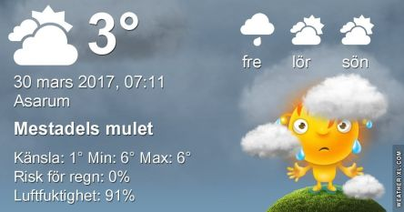

 _Morgonen börjar med regn och resten av dagen blir molnig med omkring 9 grader.  Även fredagen ser ut att bli mulen med något högre temperatur, omkring 15 grader. Lördagen bjuder på en del sol och upp till 18 grader. En längre prognos ser du [här](http://www.vackertvader.se/asarum/10d/yr-smhi)._
