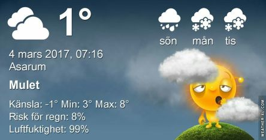

 _Molnigt och omkring 7 plusgrader idag. På söndag kan det bli en hel del snöblask och kring 3 plusgrader. Måndagen blir lite finare med en del sol och kring 5 plusgrader. Senare i veckan blir det ostadigt först med en del regn och snö. Temperaturen stiger mot slutet av veckan och då blir det plusgrader även på nätterna igen._
