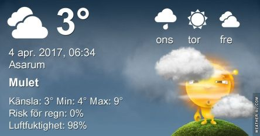

 _Dimma på morgonen men under dagen klarnar det upp och blir en del sol. Omkring 10 grader. På onsdag blir det växlande molnighet och omkring 12 grader. På torsdag blir det ungefär samma temperatur och växlande molnighet även då. En längre prognos ser du [här](http://www.vackertvader.se/asarum/10d/yr-smhi)._
