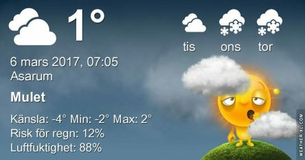

 _Det blir mest molnigt idag och endast en eller ett par plus- grader. Natten blir kall och imorgon kan solen visa sig en del. Onsdag och torsdag blir det mulet med regn och snöblandat. Slutet på veckan ser ut att bli soligt och varmare igen._
