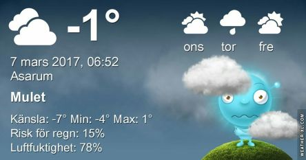

 _Molnigt och minusgrader på morgonen. Fortsatt molnigt och omkring 1 plusgrad på dagen. Natten blir kall med flera minusgrader. Onsdagen ser ut att bjuda på en del sol och någon plusgrad på dagen. På torsdagen kommer varmare luft in och det blir mest molnigt och upp till 8 grader varmt. Helgen ser ut att bli ganska solig och varmt på dagarna och kallt på nätterna._
