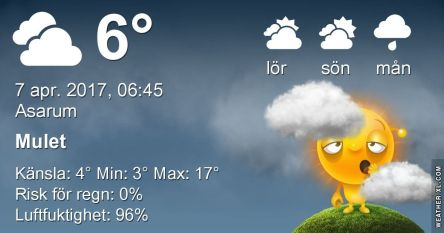

 _Dagen börjar molnigt men under dagen klarnar det upp något. Temperaturen hamnar omkring 18 grader. På lördag ser det ut att bli växlande molnighet och omkring 15 grader. På söndag blir det ungefär samma väder med växlande molnighet och omkring 17 grader. En längre prognos ser du [här](http://www.vackertvader.se/asarum/10d/yr-smhi)._
