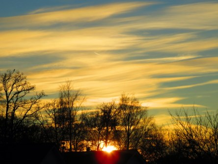

Idag går solen upp 08:07 och ned 15:30. Månen går upp 14:55 och ned 04:22 Månen är belyst 90 %. Dagens längd är 7 timmar och 23 minuter.

 Mest molnigt 1,4 C  Vindby 2 m/s WNW  Luftfuktighet 98 %  hPa 1003 Kl.02:10

 Växlande molnighet 1,5 C  Vindby 2,4 m/s SE  Luftfuktighet 98 %  hPa 1005 Kl.07:20

 Växlande molnighet 3 C  Vindby 2,6 m/s WSW  Luftfuktighet 80 %  hPa 1008 Kl.14:15

 Växlande molnighet - 0,7 C  Vindby 1 m/s SE  Luftfuktighet 81 %  hPa 1012 Kl.20:00

 

 

Högst och lägst uppmätta temperatur igår (inofficiellt privat mätare): Max 4,2 C , Min – 5,8 C Högst uppmätta vind 1,4 m/s. Högst uppmätta vindby 2,4 m/s.

Högst och lägst uppmätta temperatur igår (officiellt enligt [YR.NO](http://www.vackertvader.se/v%C3%A4derstation/karlshamn?utm_source=email&utm_medium=email&utm_campaign=asarum)) Max 2,2 C, Min – 4,6 C Högst uppmätta vind 1,9 m/s. Högst uppmätta vindby 4,7 m/s

 

 Idag blev det både soluppgång

 Och solnedgång.
