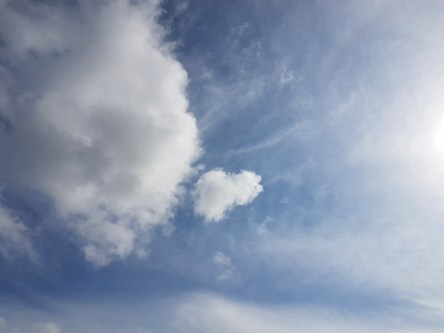

Idag går solen upp 06:21 och ned 19:32. Månen går upp 21:29 och ned 11:18 Månen är belyst 83 %. Dagens längd är 13 timmar och 11 minuter.

 Mest molnigt 10,5 C  Vindstilla  Luftfuktighet 98 %  hPa 993 Kl.01:30

 Mest molnigt 14,2 C  Vindstilla  Luftfuktighet 99 %  hPa 995 Kl.08:00

 Molnigt 18,6 C  Vindby 3 m/s E  Luftfuktighet 73 %  hPa 997 Kl.13:15

 Klart 11,4 C  Vindby 0,2 m/s E  Luftfuktighet 88 %  hPa 997  Regn 0,5 mm Kl.20:15

 

Högst och lägst uppmätta temperatur igår (inofficiellt privat mätare): Max 16,9 C , Min 11,8 C Högst uppmätta vind 3,7 m/s. Högst uppmätta vindby 5,8 m/s.

Högst och lägst uppmätta temperatur igår (officiellt enligt [YR.NO](http://www.vackertvader.se/v%C3%A4derstation/karlshamn?utm_source=email&utm_medium=email&utm_campaign=asarum)) Max 15,3 C, Min 12,6 C Högst uppmätta vind 3,1 m/s. Högst uppmätta vindby 8,6 m/s

 

 För en kort stund visade sig blå himmel och sol idag.

Spara

Spara

Spara
