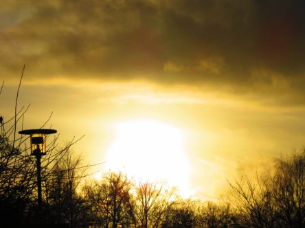

Idag går solen upp 07:30 och ned 15:57. Månen går upp 23:57 och ned 14:37 Månen är belyst 37 %. Dagens längd är 8 timmar och 27 minuter.

 Växlande molnighet - 0,1 C  Vindby 1 m/s E  Luftfuktighet 95 %  hPa 989 Kl.01:30

 Molnigt 2,6 C  Vindstilla  Luftfuktighet 98 %  hPa 988 Kl.07:45

 Växlande molnighet 8,2 C  Vindby 1,6 m/s SE  Luftfuktighet 82 %  hPa 990 Kl.14:10

 Mest klart 0,6 C  Vindstilla  Luftfuktighet 95 %  hPa 993  Regn 0,5 mm Kl.20:15

 

Högst och lägst uppmätta temperatur igår (inofficiellt privat mätare): Max 8,5 C , Min 0,8 C Högst uppmätta vind 5,8 m/s. Högst uppmätta vindby 8,5 m/s.

Högst och lägst uppmätta temperatur igår (officiellt enligt [YR.NO](http://www.vackertvader.se/v%C3%A4derstation/karlshamn?utm_source=email&utm_medium=email&utm_campaign=asarum)) Max 7,8 C, Min 2,1 C Högst uppmätta vind 4,6 m/s. Högst uppmätta vindby 13,3 m/s

 

 Solen har tittat fram till och från idag.

Spara

Spara

Spara

Spara
