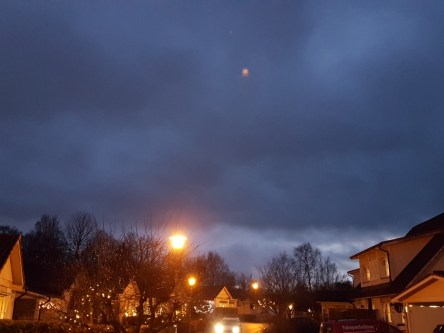

Idag går solen upp 08:23 och ned 15:24. Månen går upp 01:24 och ned 13:27 Månen är belyst 33 %. Dagens längd är 7 timmar och 1 minuter.

 Regn 1,2 C  Vindby 1,7 m/s SW  Luftfuktighet 97 %  hPa 980  Regn 3,2 mm Kl.02:30

 Regn 2,1 C  Vindby 0,8 m/s SW  Luftfuktighet 97 %  hPa 979  Regn 6,7 mm Kl.06:55

 Molnigt 2,4 C  Vindby 5,8 m/s SE  Luftfuktighet 97 %  hPa 984  Regn 11 mm Kl.13:45

 Mest klart - 2 C  Vindby 1,8 m/s SW  Luftfuktighet 84 %  hPa 996 Kl.21:10

 

 

Högst och lägst uppmätta temperatur igår (inofficiellt privat mätare): Max 3,1 C , Min – 1,1 C Högst uppmätta vind 3,1 m/s. Högst uppmätta vindby 3,7 m/s.

Högst och lägst uppmätta temperatur igår (officiellt enligt [YR.NO](http://www.vackertvader.se/v%C3%A4derstation/karlshamn?utm_source=email&utm_medium=email&utm_campaign=asarum)) Max 3,1 C, Min – 0,2 C Högst uppmätta vind 4,1 m/s. Högst uppmätta vindby 9,1 m/s

 

 Mörkret lägger sig på gatan efter en mulen och grå dag.
