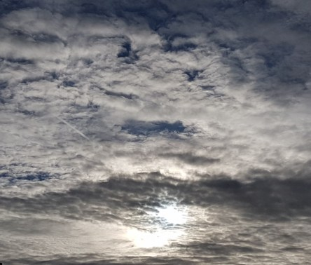

Idag går solen upp 07:27 och ned 18:05. Månen går upp 00:28 och ned 15:47 Månen är belyst 44 %. Dagens längd är 10 timmar och 38 minuter.

 Klart 8,1 C  Vindby 3,4 m/s E  Luftfuktighet 76 %  hPa 1003 Kl.02:05

 Mest klart 6,1 C  Vindby 1,8 m/s E  Luftfuktighet 84 %  hPa 1009 Kl.07:30

 Tunna slöjmoln 19,4 C  Vindby 2,7 m/s SW  Luftfuktighet 44 %  hPa 1014 Kl.13:45

 Molnigt 9,1 C  Vindstilla  Luftfuktighet 85 %  hPa 1015 Kl.19:50

 

Högst och lägst uppmätta temperatur igår (inofficiellt privat mätare): Max 13,6 (?) C , Min 7,7 C Högst uppmätta vind ? m/s. Högst uppmätta vindby 6,5 (?) m/s.

Högst och lägst uppmätta temperatur igår (officiellt enligt [YR.NO](http://www.vackertvader.se/v%C3%A4derstation/karlshamn?utm_source=email&utm_medium=email&utm_campaign=asarum)) Max ? C, Min ? C Högst uppmätta vind ? m/s. Högst uppmätta vindby ? m/s

 

 Ganska dramatiska moln av olika slag idag. Både äkta och människogjorda.

Spara

Spara

Spara

Spara

Spara

Spara
