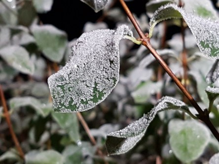
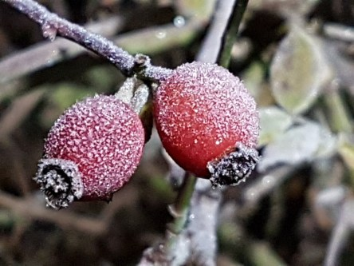

Idag går solen upp 07:35 och ned 15:54. Månen går upp 02:21 och ned 15:00 Månen är belyst 19 %. Dagens längd är 8 timmar och 19 minuter.

 Klart - 7 C  Vindstilla  Luftfuktighet 92 %  hPa 1011 Kl.02:15

 Mest klart - 5,5 C  Vindstilla  Luftfuktighet 92 %  hPa 1010 Kl.06:30

 Regn 4,8 C  Vindby 1,7 m/s N  Luftfuktighet 99 %  hPa 1006  Regn 1,7 mm Kl.14:10

 Molnigt 8,1 C  Vindby 1,8 m/s ESE  Luftfuktighet 98 %  hPa 1007  Regn 3,5 mm Kl.20:15

 

Högst och lägst uppmätta temperatur igår (inofficiellt privat mätare): Max 8,8 C , Min – 5 C Högst uppmätta vind 2 m/s. Högst uppmätta vindby 4,1 m/s.

Högst och lägst uppmätta temperatur igår (officiellt enligt [YR.NO](http://www.vackertvader.se/v%C3%A4derstation/karlshamn?utm_source=email&utm_medium=email&utm_campaign=asarum)) Max 3,8 C, Min – 4,6 C Högst uppmätta vind 3 m/s. Högst uppmätta vindby 6,2 m/s

 

 Frosten lägger sig som ett vitt täcke över hela naturen.

Spara

Spara

Spara

Spara
