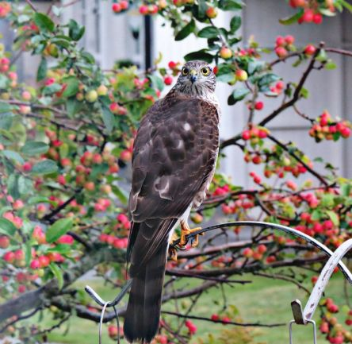

Idag går solen upp 06:29 och ned 19:22. Månen går upp 00:19 och ned 16:11 Månen är belyst 41 %. Dagens längd är 12 timmar och 53 minuter.

 Molnigt 12,1 C  Vindby 5,4 m/s ENE  Luftfuktighet 97 %  hPa 978  Regn 1,7 mm Kl.02:20

 Regn 11,9 C  Vindby 2,8 m/s ESE  Luftfuktighet 97 %  hPa 979  Regn 4 mm Kl.06:20

 Molnigt 17,8 C  Vindby 1,6 m/s E  Luftfuktighet 87 %  hPa 983  Regn 4,5 mm Kl.13:45

 Molnigt 11,2 C   Vindby 0,4 m/s E  Luftfuktighet 97 %  hPa 988  Regn 8,5 mm Kl.19:45

 

Högst och lägst uppmätta temperatur igår (inofficiellt privat mätare): Max 17,3 C , Min 7,3 C Högst uppmätta vind 3,7 m/s. Högst uppmätta vindby 7,4 m/s.

Högst och lägst uppmätta temperatur igår (officiellt enligt [YR.NO](http://www.vackertvader.se/v%C3%A4derstation/karlshamn?utm_source=email&utm_medium=email&utm_campaign=asarum)) Max 14,8 C, Min 9,2 C Högst uppmätta vind 4,3 m/s. Högst uppmätta vindby 9 m/s

 

 _Mitt i ösregnet fick jag fint besök._

Spara

Spara

Spara

Spara

Spara
