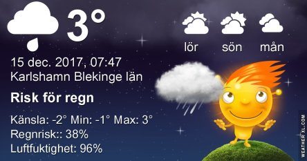
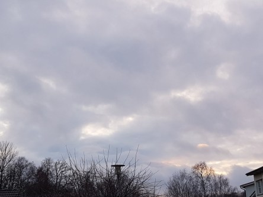

Idag går solen upp 08:26 och ned 15:24. Månen går upp 04:57 och ned 14:27 Månen är belyst 9 %. Dagens längd är 6 timmar och 58 minuter.

 Mest molnigt 2,6 C  Vindby 3,4 m/s SSE  Luftfuktighet 89 %  hPa 980 Kl.02:25

 Regn 2,4 C  Vindby 5 m/s SE  Luftfuktighet 93 %  hPa 981  Regn 0,5 mm Kl.07:10

 Molnigt 5,1 C  Vindby 1,2 m/s E  Luftfuktighet 97 %  hPa 986  Regn 2,7 mm Kl.13:35

 Molnigt 1 C  Vindby 1 m/s NE  Luftfuktighet 96 %  hPa 990  Regn 3,2 mm Kl.20:00

 

 Dagen började blåsigt och med regnskurar.

 

Högst och lägst uppmätta temperatur igår (inofficiellt privat mätare): Max 3,3 C , Min 1,1 C Högst uppmätta vind 4,4 m/s. Högst uppmätta vindby 7,4 m/s.

Högst och lägst uppmätta temperatur igår (officiellt enligt [YR.NO](http://www.vackertvader.se/v%C3%A4derstation/karlshamn?utm_source=email&utm_medium=email&utm_campaign=asarum)) Max 3,1 C, Min 0,8 C Högst uppmätta vind 4,2 m/s. Högst uppmätta vindby 10,7 m/s

 

 Inte så mycket att orda om vädret just nu. Det är sig ganska likt från dag till dag. 50 nyanser av grått.
