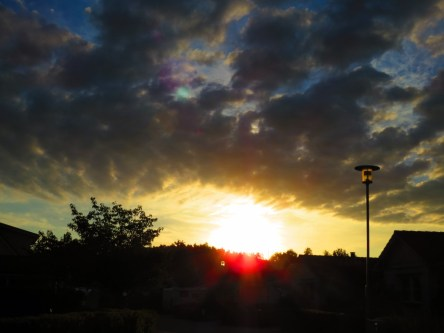

Idag går solen upp 05:29 och ned 20:39. Månen går upp 23:57 och ned 14:49 Månen är belyst 50 %. Dagens längd är 15 timmar och 10 minuter.

 Klart 5,9 C  Vindstilla  Luftfuktighet 99 %   hPa 1020 Kl.01:25

 Mest molnigt 8,3 C  Vindstilla  Luftfuktighet 99 %  hPa 1019 Kl.06:55

 Mest molnigt 25,6 C  Vindby 4,2 m/s E  Luftfuktighet 67 %  hPa 1018 Kl.14:25

 Växlande molnighet 16,4 C  Vindby 1,4 m/s N  Luftfuktighet 81 %  hPa 1016 Kl.19:50

 

Högst och lägst uppmätta temperatur igår (inofficiellt privat mätare): Max 24,4 C , Min 3,7 C Högst uppmätta vind 3,1 m/s. Högst uppmätta vindby 4,1 m/s.

Högst och lägst uppmätta temperatur igår (officiellt enligt [YR.NO](http://www.vackertvader.se/v%C3%A4derstation/karlshamn?utm_source=email&utm_medium=email&utm_campaign=asarum)) Max 20,1 C, Min 4,4 C Högst uppmätta vind 3,6 m/s. Högst uppmätta vindby 18 m/s

 

Spara

Spara

Spara

Spara

Spara
