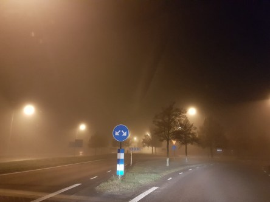
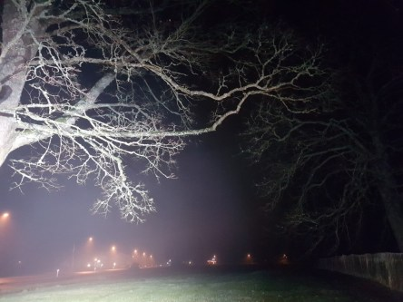

Idag går solen upp 07:39 och ned 15:50. Månen går upp 04:47 och ned 15:38 Månen är belyst 6 %. Dagens längd är 8 timmar och 11 minuter.

 Mest molnigt 1,4 C  Vindstilla  Luftfuktighet 96 %  hPa 1018 Kl.02:10

 Tjock dimma 2,2 C  Vindby 0,3 m/s N  Luftfuktighet 99 %  hPa 1018 Kl.06:25

 Mest molnigt 6,9 C  Vindby 0,3 m/s N  Luftfuktighet 99 %  hPa 1016 Kl.14:00

 Molnigt 7 C  Vindby 3,4 m/s N  Luftfuktighet 98 %  hPa 1012 Kl.19:50

 

Högst och lägst uppmätta temperatur igår (inofficiellt privat mätare): Max 11,5 C , Min – 0,9 C Högst uppmätta vind 3,4 m/s. Högst uppmätta vindby 6,1 m/s.

Högst och lägst uppmätta temperatur igår (officiellt enligt [YR.NO](http://www.vackertvader.se/v%C3%A4derstation/karlshamn?utm_source=email&utm_medium=email&utm_campaign=asarum)) Max 9 C, Min – 1,2 C Högst uppmätta vind 7,9 m/s. Högst uppmätta vindby 8,2 m/s

 

 Det var väldigt dimmigt på morgonen idag.
