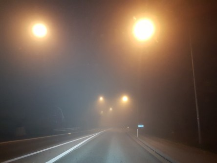
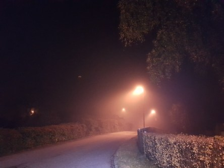

Idag går solen upp 07:33 och ned 17:58. Månen går upp 03:01 och ned 17:13 Månen är belyst 14 %. Dagens längd är 10 timmar och 25 minuter.

 Molnigt 12,1 C  Vindby 0,7 m/s NW  Luftfuktighet 97 %  hPa 1013 Kl.01:40

 Dimma  11,3 C  Vindby 0,8 m/s SE  Luftfuktighet 98 %  hPa 1011 Kl.06:35

 Molnigt 16,5 C  Vindby 2 m/s WNW  Luftfuktighet 80 %  hPa 1012 Kl.13:45

 Molnigt 13,2 C  Vindstilla  Luftfuktighet 90 %  hPa 1014 Kl.19:55

 

Högst och lägst uppmätta temperatur igår (inofficiellt privat mätare): Max 22,2 (i solen) C , Min 8,5 C Högst uppmätta vind 4,4 m/s. Högst uppmätta vindby 6,1  m/s.

Högst och lägst uppmätta temperatur igår (officiellt enligt [YR.NO](http://www.vackertvader.se/v%C3%A4derstation/karlshamn?utm_source=email&utm_medium=email&utm_campaign=asarum)) Max 16,8 C, Min 9,6 C Högst uppmätta vind 2,6 m/s. Högst uppmätta vindby 7 m/s

 

 Tät dimma på morgonen och mycket varmt för årstiden.

Spara

Spara

Spara

Spara

Spara
