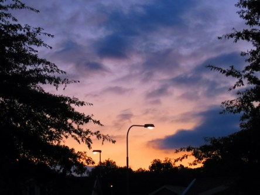

Idag går solen upp 06:33 och ned 19:16. Månen går upp 01:26 och ned 17:45 Månen är belyst 20 %. Dagens längd är 12 timmar och 43 minuter.

 Mest molnigt 10,3 C  Vindby 1,8 m/s N  Luftfuktighet 92 %  hPa 1001 Kl.02:20

 Mest molnigt 5,6 C  Vindstilla  Luftfuktighet 97 %  hPa 1002 Kl.06:40

 Växlande molnighet 22,1 C  Vindby 3,6 m/s E  Luftfuktighet 65 %  hPa 1006 Kl.13:55

 Klart 8,8 C  Vindstilla  Luftfuktighet 90 %  hPa 1008 Kl.19:55

 

Högst och lägst uppmätta temperatur igår (inofficiellt privat mätare): Max 20,2 C , Min 8,9 C Högst uppmätta vind 3,4 m/s. Högst uppmätta vindby 5,4 m/s.

Högst och lägst uppmätta temperatur igår (officiellt enligt [YR.NO](http://www.vackertvader.se/v%C3%A4derstation/karlshamn?utm_source=email&utm_medium=email&utm_campaign=asarum)) Max 16,7 C, Min 9,2 C Högst uppmätta vind 3 m/s. Högst uppmätta vindby 9,3 m/s

 

 För första gången på länge gick det att se soluppgången idag.

Spara

Spara

Spara

Spara

Spara

Spara
