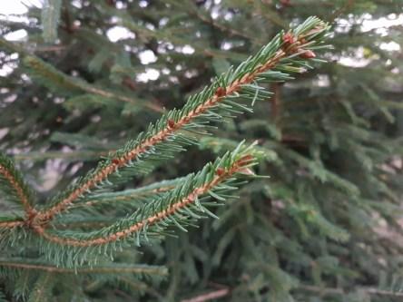

Idag går solen upp 07:41 och ned 15:48. Månen går upp 05:57 och ned 15:59 Månen är belyst 2 %. Dagens längd är 8 timmar och 7 minuter.

 Molnigt 6,3 C  Vindby 2,2 m/s ESE  Luftfuktighet 93 %  hPa 1009  Regn 0,5 mm Kl.02:00

 Mest klart 3,5 C  Vindby 3,4 m/s E  Luftfuktighet 96 %  hPa 1011 Kl.06:25

 Mest klart 10 C  Vindby 4,4 m/s NE  Luftfuktighet 65 %  hPa 1013 Kl.14:05

 Mest klart 2,6 C  Vindby 1,6 m/s E  Luftfuktighet 89 %  hPa 1012 Kl.20:00

 

Högst och lägst uppmätta temperatur igår (inofficiellt privat mätare): Max 8,2 C , Min – 1,1 C Högst uppmätta vind 3,7 m/s. Högst uppmätta vindby 5,1 m/s.

Högst och lägst uppmätta temperatur igår (officiellt enligt [YR.NO](http://www.vackertvader.se/v%C3%A4derstation/karlshamn?utm_source=email&utm_medium=email&utm_campaign=asarum)) Max 7,9 C, Min – 1 C Högst uppmätta vind 3 m/s. Högst uppmätta vindby 7,2 m/s

 

 Nu är det bara barrträden som är gröna.
