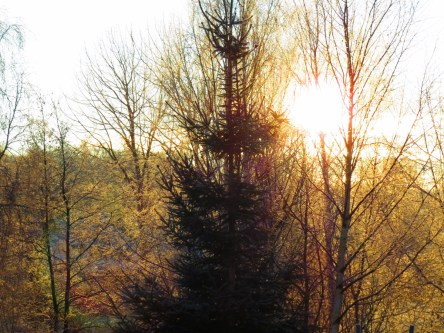

Idag går solen upp 08:28 och ned 15:24. Månen går upp 07:08 och ned 15:25 Månen är belyst 1 %. Dagens längd är 6 timmar och 56 minuter.

 Klart - 5,8 C  Vindstilla  Luftfuktighet 92 %  hPa 1004 Kl.01:25

 Klart - 6,5 C  Vindstilla  Luftfuktighet 94 %  hPa 1007 Kl.06:35

 Molnigt 0 C  Vindby 1,8 m/s SW  Luftfuktighet 86 %  hPa 1012 Kl.13:10

 Molnigt - 1,8 C  Vindstilla  Luftfuktighet 88 %   hPa 1015 Kl.20:00

 

 Idag vaknade vi upp till en solig och rimfrostgnistrande dag.

 

Högst och lägst uppmätta temperatur igår (inofficiellt privat mätare): Max 6,2 C , Min – 5,1 C Högst uppmätta vind 1 m/s. Högst uppmätta vindby 2,7 m/s.

Högst och lägst uppmätta temperatur igår (officiellt enligt [YR.NO](http://www.vackertvader.se/v%C3%A4derstation/karlshamn?utm_source=email&utm_medium=email&utm_campaign=asarum)) Max 1,7 C, Min - 3,5 C Högst uppmätta vind 2,1 m/s. Högst uppmätta vindby 5,1 m/s

 

 Efter en kall natt gick solen upp och lyste upp den kalla morgonen.
