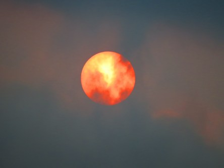

Idag går solen upp 07:35 och ned 17:55. Månen går upp 04:18 och ned 17:34 Månen är belyst 8 %. Dagens längd är 10 timmar och 20 minuter.

 Molnigt 10,6 C  Vindstilla  Luftfuktighet 97 %  hPa 1014 Kl.01:30

 Molnigt 12,1 C  Vindby 2 m/s E  Luftfuktighet 97 %  hPa 1011 Kl.07:00

 Molnigt 16,3 C  Vindby 6,6 m/s NE  Luftfuktighet 69 %  hPa 1008 Kl.14:25

 Växlande molnighet 10,3 C  Vindby 1,6 m/s E  Luftfuktighet 87 %  hPa 1008 Kl.21:05

 

Högst och lägst uppmätta temperatur igår (inofficiellt privat mätare): Max 16,7 C , Min 9,3 C Högst uppmätta vind 2,4 m/s. Högst uppmätta vindby 4,8  m/s.

Högst och lägst uppmätta temperatur igår (officiellt enligt [YR.NO](http://www.vackertvader.se/v%C3%A4derstation/karlshamn?utm_source=email&utm_medium=email&utm_campaign=asarum)) Max 15,8 C, Min 10,8 C Högst uppmätta vind 2,3 m/s. Högst uppmätta vindby 7,8 m/s

 

 Himlen blev väldigt mörk idag och solen syntes en kort stund som ett knallrött eldklot. Detta fenomen uppstod på grund av att orkanen Ophelia har fört med sig aska och smuts från skogsbränderna i Portugal och Spanien.

Spara

Spara

Spara

Spara

Spara
