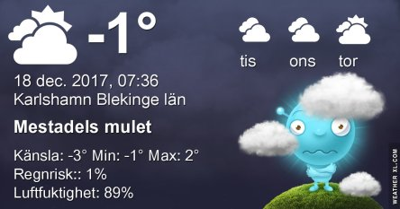
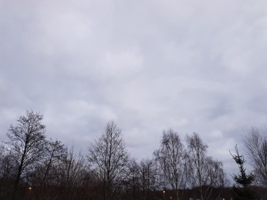
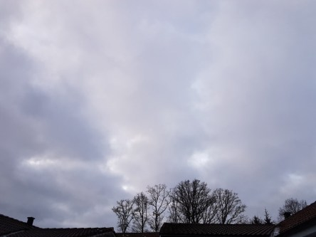

Idag går solen upp 08:29 och ned 15:24. Månen går upp 08:07 och ned 16:03 Månen är belyst 0 %. Dagens längd är 6 timmar och 55 minuter.

 Tunna moln - 6,3 C  Vindstilla  Luftfuktighet 91 %  hPa 1016 Kl.02:25

 Växlande molnighet - 4,8 C  Vindstilla  Luftfuktighet 92 %  hPa 1017 Kl.07:15

 Molnigt 2,5 C  Vindby 0,7 m/s N  Luftfuktighet 75 %  hPa 1019 Kl.13:45

 Molnigt 1,1 C  Vindby 1,4 m/s E  Luftfuktighet 82 %  hPa 1020 Kl.19:55

 

 Efter en riktigt kylig natt blir det lite mildare igen.

 

Högst och lägst uppmätta temperatur igår (inofficiellt privat mätare): Max 2 C , Min – 6,6 C Högst uppmätta vind 1,7 m/s. Högst uppmätta vindby 2,4 m/s.

Högst och lägst uppmätta temperatur igår (officiellt enligt [YR.NO](http://www.vackertvader.se/v%C3%A4derstation/karlshamn?utm_source=email&utm_medium=email&utm_campaign=asarum)) Max - 0,2 C, Min – 6 C Högst uppmätta vind 2,5 m/s. Högst uppmätta vindby 5,1 m/s

 

 Återigen molnigt och grått.
